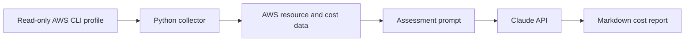

# AI Cloud Cost Detective (AWS + Claude)

A command-line tool that scans an AWS region using the AWS CLI, identifies possible cost waste and configuration risks, and generates a Markdown report with actionable remediation guidance.

## Architecture



## Implementation Scope

This AWS-native implementation:

- Collects EC2, EBS, Elastic IP, load balancer, RDS, S3, and Cost Explorer data through the AWS CLI.
- Uses a read-only AWS CLI profile; it does not create, modify, or delete AWS resources.
- Sends collected data together with an assessment prompt to the Claude API.
- Persists the generated report locally in the `cost_reports/` directory.

The project is inspired by [Abhishek Veeramalla's AI-Cloud-Cost-Detective](https://github.com/iam-veeramalla/AI-Cloud-Cost-Detective). This version is scoped to AWS and implemented as a single-user Python CLI rather than a multi-tenant web application.

## What It Detects

- Potentially over-provisioned EC2 and RDS resources
- Unattached EBS volumes and unassociated Elastic IPs
- Load balancers without healthy targets
- S3 buckets without lifecycle policies
- Cost breakdown by AWS service for the previous 30 days

## Technology Stack

- Python 3
- AWS CLI
- AWS services: EC2, EBS, Elastic IP, ELBv2, RDS, S3, Cost Explorer
- Anthropic Claude API

## Security Design

- AWS access is intended to use a dedicated read-only IAM policy.
- Credentials are supplied through a named AWS CLI profile and are not hardcoded.
- API keys are supplied through the `ANTHROPIC_API_KEY` environment variable.
- Generated reports are written locally.

## Setup

```bash
pip install -r requirements.txt
aws configure --profile cost-detective-readonly
```

Set the Claude API key:

```bash
# Windows (cmd)
set ANTHROPIC_API_KEY=your_key_here

# macOS/Linux
export ANTHROPIC_API_KEY=your_key_here
```

## Usage

```bash
python cost_detective.py --region ap-south-1 --profile cost-detective-readonly
```

The script writes a report to:

```text
cost_reports/cost_report_<region>_<timestamp>.md
```

## Repository Structure

```text
.
├── prompt.md              # Assessment prompt template
├── cost_detective.py      # AWS CLI data collection and report generation
├── requirements.txt       # Python dependency
└── cost_reports/          # Generated reports (git-ignored)
```

## Next Evidence to Add

A sanitized, real report generated from a test AWS account will be added here after execution.
